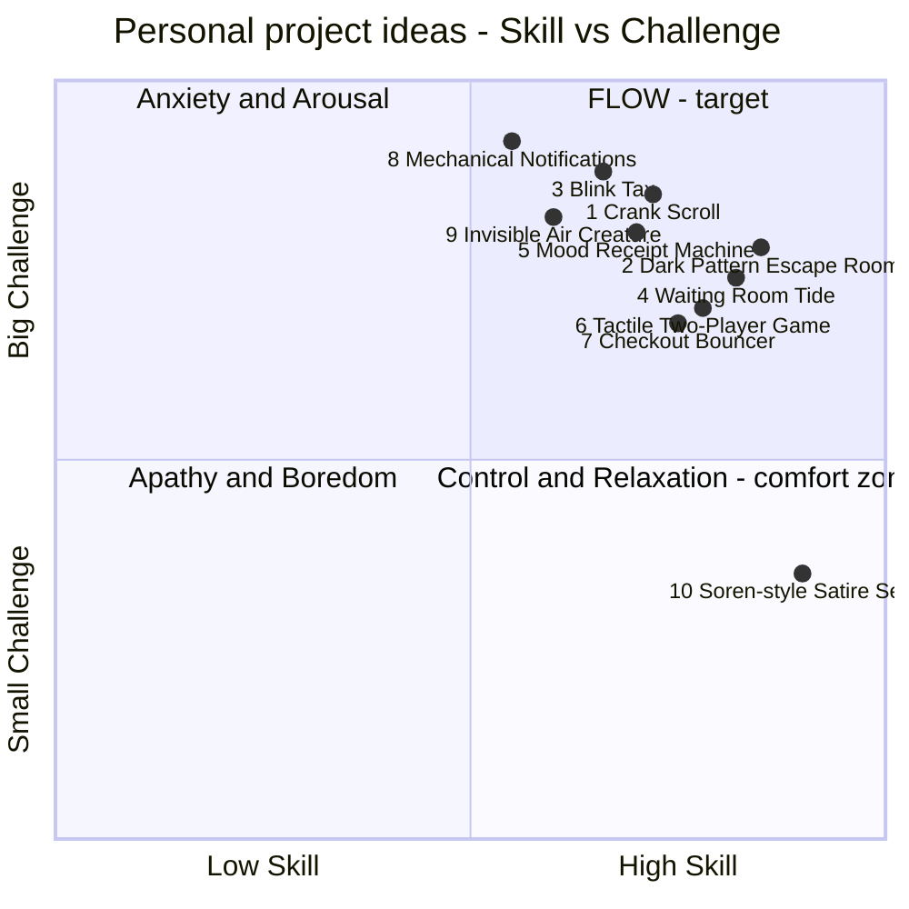

# Project Ideas on the Skill × Challenge Axis

> Companion to `PROJECT_BRIEF.md`. Every idea here is plotted on the deck's diagram (**X: Low → High skill**, **Y: Small → Big challenge**) and placed on Csikszentmihalyi's Flow Model.
> **Strategy:** start from skills I'm already **high** in (interaction/UI design, prototyping, usability testing, cardboard/physical mock-ups), then attach a **big** challenge so the project lands in **Flow**, or in **Arousal** if I want to learn something new.

---

## The map

*(The Mermaid chart renders in GitHub, Obsidian, VS Code preview, etc. Coordinates are 0–1.)*

| Zone | Ideas |
|---|---|
| **Flow** (high skill · big challenge) | 1, 2, 3, 4, 5, 6, 7 |
| **Arousal** (mid skill · very big challenge: deliberate learning) | 8, 9 |
| **Control / Relaxation** (comfort zone: only as a fallback, or push it up) | 10 |

> ⚠️ **Recalibrate:** the X position depends on *my* skills. If I'm weaker or stronger at coding/electronics than assumed, slide the idea left or right. The aim is to stay in the top-right.

---

## Template used for each idea

- **Theme** · **Venn** (Challenging / Fun / Personal) · **Skill × Challenge**
- **Target audience** (Req. 1) · **Interactivity** (Req. 2) · **External test** (Req. 3)
- **High skills used → Big challenge added** · **Toolbox methods** · **Reference** · **Make it personal**

---

## FLOW ZONE: high skill + big challenge

### 1. Crank Scroll
A small physical hand-crank (rotary encoder + microcontroller acting as a Bluetooth mouse/keyboard) that is the **only** way to scroll a social feed. The faster you want to doomscroll, the harder you have to work.

- **Theme:** Friction! (+ Play) · **Venn:** ●●● · **Position:** Skill 0.72 / Challenge 0.85 → Flow
- **Audience:** Students (18–24) who doomscroll before bed.
- **Interactivity:** Physical crank → real scroll events on a phone/laptop.
- **External test:** Flatmates, friends at other schools, family. Run a 3-night diary study.
- **High skills → Big challenge:** Cardboard prototyping + usability testing → electronics, BLE HID, enclosure design.
- **Toolbox:** Self-ethnography (my screen-time data), interviews, cardboard → hi-fi, usability testing.
- **Reference:** Soren Iverson's satire, made physical.
- **Make it personal:** Start from my own screen-time numbers.

### 2. Dark Pattern Escape Room
A browser game (neal.fun vibe) where each level is a real dark pattern you have to escape: cookie walls, confirmshaming, roach-motel unsubscribes, sneak-into-basket. You win by spotting and beating the trick. Ends with a "your manipulation resistance" score.

- **Theme:** Play + Friction! · **Venn:** ●●● · **Position:** Skill 0.85 / Challenge 0.78 → Flow
- **Audience:** Non-designers, e.g. parents or teenagers who don't know what dark patterns are.
- **Interactivity:** Fully playable web prototype.
- **External test:** Parents / relatives / a secondary-school class. Think-aloud + post-game quiz.
- **High skills → Big challenge:** UI design + Nielsen/Norman/Laws of UX knowledge (inverted on purpose) → game design, level pacing, coding or advanced prototyping (Figma variables / ProtoPie / web).
- **Toolbox:** Nielsen's heuristics (as a checklist of what to *break*), Laws of UX, usability testing.
- **Reference:** Neal Agarwal, Soren Iverson.
- **Make it personal:** Use dark patterns that have actually tricked me.

### 3. Blink Tax
A webcam piece (MediaPipe face mesh in the browser) where content only plays while you don't blink. Every blink "costs" you: the video rewinds, an ad appears, or a counter shows how much of your attention was sold. It makes attention-economy mechanics visible on your own body.

- **Theme:** Invisible/Visible + Friction! · **Venn:** ●●● · **Position:** Skill 0.66 / Challenge 0.88 → Flow (Arousal edge)
- **Audience:** Heavy short-form video users (TikTok/Reels).
- **Interactivity:** Body-as-input via webcam.
- **External test:** Pop-up at a library, café, or open day. 2-minute sessions + exit interview.
- **High skills → Big challenge:** Interaction design + testing → computer vision (MediaPipe / TouchDesigner).
- **Toolbox:** Observation, interviews, hi-fi prototype, design critique.
- **Reference:** Tjerk's *Blink of an Eye*, Soren Iverson.
- **Make it personal:** Measure my own blink/scroll habits first.

### 4. Waiting Room Tide
Takes the Sprint 1 usability case (the dental-clinic dashboard shown in the deck, which I missed) and designs the **patient** side: a playful interactive screen or object in a waiting room that makes the invisible queue visible (a tide that rises as your turn approaches, little characters walking forward) and lets patients do a calming micro-interaction while they wait.

- **Theme:** Invisible/Visible + Play · **Venn:** ●●● · **Position:** Skill 0.82 / Challenge 0.74 → Flow
- **Audience:** Anxious patients (or parents with kids) in GP/dental waiting rooms.
- **Interactivity:** Touch screen or physical dial; queue state changes live (simulated).
- **External test:** A real waiting room (GP, dentist, physio, or the school's health desk), or a staged one with non-classmates.
- **High skills → Big challenge:** Healthcare UI + dashboard knowledge → physical/spatial installation, emotional design, testing in a sensitive context.
- **Toolbox:** Observation (sit in a waiting room), empathy map, interviews, hi-fi prototype, usability testing.
- **Reference:** Andy J Pizza's *Invisible Things* (anxiety as a character).
- **Make it personal:** Doubles as catching up on the Usability sprint I missed: I learn its methods while doing this project.

### 5. Mood Receipt Machine
A small kiosk: answer three playful questions with physical buttons and a thermal receipt printer prints a unique "feeling creature" (Andy J Pizza style) plus a tiny prescription ("take one walk, twice daily"). It makes invisible emotions visible and takeable.

- **Theme:** Invisible/Visible + Play · **Venn:** ●●● · **Position:** Skill 0.70 / Challenge 0.80 → Flow
- **Audience:** Students during exam stress / visitors to a student wellbeing space.
- **Interactivity:** Buttons → generative illustration → printed output.
- **External test:** Place it in a library, canteen, or student union for a day. Count prints, collect reactions.
- **High skills → Big challenge:** Illustration/UI + interaction flows → thermal printer, generative graphics, physical enclosure (OSB, like Marc's *Prutt'l poal*).
- **Toolbox:** Interviews, card sorting (which feelings), cardboard → hi-fi, observation.
- **Reference:** Andy J Pizza, Marc's *Prutt'l poal*, Thomas's riso work (could print the creatures as riso stickers).
- **Make it personal:** Draw the creatures myself.

### 6. Tactile Two-Player Game
A board/table game designed so a blind or visually impaired player and a sighted player play on equal terms: tactile pieces, sound cues, maybe a microcontroller that speaks the board state. Builds on the Accessibility sprint.

- **Theme:** Play (+ Invisible/Visible: the sighted player plays partly "blind") · **Venn:** ●●● · **Position:** Skill 0.78 / Challenge 0.70 → Flow
- **Audience:** Mixed-ability pairs (visually impaired person + friend/family member).
- **Interactivity:** Physical play + electronic audio feedback.
- **External test:** Local visual-impairment association, or blindfolded sighted testers as a first round, then at least one real VI player.
- **High skills → Big challenge:** Cardboard prototyping + inclusive design → game balancing, laser-cut/3D-printed tactile parts, audio electronics.
- **Toolbox:** Co-design, cardboard prototyping, Norman's principles (affordances by touch), usability testing.
- **Reference:** Sprint 2 lesson: "design *with* people, in physical form".
- **Make it personal:** Base it on a game I loved growing up.

### 7. Checkout Bouncer
A browser extension that stands between you and "Buy now": before checkout it adds escalating, witty friction. You have to justify the purchase, wait 24h, see the price in hours of work, or get a roast from a bouncer character.

- **Theme:** Friction! · **Venn:** ●●○ (make it personal) · **Position:** Skill 0.75 / Challenge 0.68 → Flow (Control edge)
- **Audience:** Students who impulse-buy online (fashion, food delivery).
- **Interactivity:** Live on real shopping sites.
- **External test:** 5 non-classmates install it for a week + before/after interviews.
- **High skills → Big challenge:** UX writing + flows → shipping working software (extension), behaviour-change design, longitudinal testing.
- **Toolbox:** Interviews, self-ethnography, Laws of UX (Goal-gradient, Peak-end), usability testing.
- **Reference:** Soren Iverson.
- **Make it personal:** Audit my own last 3 months of purchases.

---

## AROUSAL ZONE: big stretch, deliberate learning (riskier in 3 weeks)

### 8. Mechanical Notifications
A Neil-Mendoza-style object: a framed portrait or plant whose mechanical arm taps, waves, or droops based on invisible digital activity (group-chat volume, unread emails, phone pickups). Notifications become a physical presence in a room.

- **Theme:** Invisible/Visible + Play · **Position:** Skill 0.55 / Challenge 0.92 → Arousal
- **Audience:** Remote workers / students who study at home.
- **Interactivity:** Servos/motors driven by live data.
- **External test:** Place it on someone's desk for 2 days, then interview them.
- **Risk:** Mechanics + APIs in about 3 weeks. Scope down to *one* motion and *one* data source.
- **Reference:** Neil Mendoza, *Mechanical Masterpieces*.

### 9. Invisible Air Creature
A soft paper/fabric creature that slowly "suffocates" (deflates, droops, changes colour) as CO₂ rises in a study room, nudging people to open a window. Revives when air is fresh.

- **Theme:** Invisible/Visible · **Position:** Skill 0.60 / Challenge 0.82 → Arousal
- **Audience:** Students in study rooms / office workers.
- **Interactivity:** Environment sensor → motion/light output; people respond by opening windows.
- **External test:** Library study room or a shared office for a day. Log window openings.
- **Risk:** Sensor + actuator + soft materials. Prototype the behaviour with Wizard-of-Oz first.
- **Reference:** Andy J Pizza (invisible thing as a character), Tjerk (sensing).

---

## CONTROL / RELAXATION: comfort zone (fallback only)

### 10. Soren-style Satire Series
A series of 5–8 satirical hi-fi UI concepts critiquing everyday apps (Friction! / Invisible-Visible). **On its own this is the "designing a concept for an app" bubble from slide 13: high skill, small challenge.**

- **Position:** Skill 0.90 / Challenge 0.35 → Control/Relaxation ❌ not enough on its own
- **How to push it up into Flow:** make them **interactive** and **deploy** them. For example, put one fake app on strangers' phones and record reactions, or run an Instagram account and test the satire with a real audience. That covers Req. 2 and Req. 3.

---

## Quick comparison

| # | Idea | Theme | Zone | Audience reachable outside class? | Build risk (3 wks) |
|---|---|---|---|---|---|
| 1 | Crank Scroll | Friction! | Flow | ✅ easy | Medium |
| 2 | Dark Pattern Escape Room | Play / Friction! | Flow | ✅ easy | Medium |
| 3 | Blink Tax | Invisible/Visible | Flow | ✅ pop-up | Medium–High |
| 4 | Waiting Room Tide | Invisible/Visible / Play | Flow | ⚠️ needs a venue | Medium |
| 5 | Mood Receipt Machine | Invisible/Visible / Play | Flow | ✅ public space | Medium |
| 6 | Tactile Two-Player Game | Play | Flow | ⚠️ needs VI contact | Medium–High |
| 7 | Checkout Bouncer | Friction! | Flow | ✅ easy | Low–Medium |
| 8 | Mechanical Notifications | Invisible/Visible | Arousal | ✅ | High |
| 9 | Invisible Air Creature | Invisible/Visible | Arousal | ✅ | High |
| 10 | Satire Series | Friction! | Control | ✅ | Low (too low) |

## How to choose (do this this week, wk 41)

1. **Score each idea 1–5** on Challenging · Fun · Personal. Drop anything under 10/15.
2. **Plot myself honestly.** Move each dot left or right based on my real skills. Keep the ones still top-right.
3. **Check the test.** Can I name *who* outside class I'll test with, and *where*, before wk 43? If not, drop it.
4. **Pick 2 finalists.** Make a 30-minute cardboard or paper version of each before autumn break.
5. **Record the choice** in `PROJECT_BRIEF.md` → Section 8.
